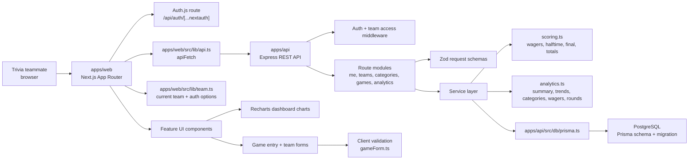

# SmartFellas Dependency Map

Generated on 2026-05-06 from the current repository state.

## System Diagram

## Runtime Dependencies

| Layer | Package or Service | Used By | Notes |
| --- | --- | --- | --- |
| Workspace | `pnpm` workspaces | Root, web, API | Root scripts fan out with `corepack pnpm -r`. |
| Frontend | `next`, `react`, `react-dom` | `apps/web` | App Router pages under `apps/web/src/app`. |
| Frontend auth | `next-auth` | `apps/web/src/lib/auth.ts`, auth route | Current API auth path uses bearer-style identity forwarding through `apiFetch`. |
| Frontend charts | `recharts` | Dashboard chart components | Used for trends, category bars, and wager bars. |
| Validation | `zod` | API schemas, web config | API request validation is the source of truth. |
| API server | `express` | `apps/api/src/index.ts` | Mounts health, me, teams, categories, games, analytics. |
| API hardening | `helmet`, `cors`, `express-rate-limit` | Express app setup | CORS uses `WEB_ORIGIN`; rate limit is global. |
| Persistence | `@prisma/client`, `prisma` | API services, migrations | Prisma client is generated into `apps/api/src/generated/prisma`. |
| Database | PostgreSQL | Prisma datasource | Team-scoped structured trivia history. |
| Money/math | `decimal.js` | API dependency set | Useful for prize/decimal handling; Prisma decimals are converted at response boundaries. |
| Testing | `vitest`, `supertest` | `apps/api/tests` | API/scoring/team-access coverage exists; web test script is currently placeholder. |
| Deployment | Vercel, Node API host, managed Postgres | README/deploy docs | Docker compose supports private all-in-one deployment. |

## Source Dependency Flow

### Web App

- Routes under `apps/web/src/app/(app)` call `getCurrentTeam()` from `apps/web/src/lib/team.ts` to resolve the selected team and auth options.
- `getCurrentTeam()` depends on `apps/web/src/lib/session.ts`, which wraps `next-auth`, and `apps/web/src/lib/api.ts`, which calls the Express API.
- Dashboard page fans out to six API calls: summary, trends, game history, categories, wagers, and rounds.
- Game entry uses `GameForm` plus section components for meta, regular rounds, halftime, and final question.
- Form draft preservation is isolated in `apps/web/src/lib/formDrafts.ts`.
- Role-aware UI gates use `apps/web/src/lib/permissions.ts`, but the API remains the enforcement boundary.

### API App

- `apps/api/src/index.ts` creates the Express app, applies security middleware, and mounts route modules under `/api`.
- Route modules parse params/body, call `requireAuth`, call `requireTeamAccess`, then delegate to services.
- Zod schemas in `apps/api/src/schemas` validate team, category, and game payloads.
- `services/games.ts` owns create/update/list/detail/delete behavior. Creates and updates run in Prisma transactions and recalculate server-side scoring.
- `services/scoring.ts` owns product-critical trivia rules: regular round wager sets, halftime partial credit, final wager win/loss, and totals.
- `services/analytics.ts` aggregates dashboard data from games, questions, halftime, and final question rows.
- `services/users.ts`, `services/teams.ts`, and `services/teamMembers.ts` manage identity sync, team creation, member reads, and direct member addition.

### Data Model

- `User` has many `TeamMember` rows and created games.
- `Team` owns members, games, and categories.
- `Game` owns 18 regular `Question` rows, optional `Halftime`, and optional `FinalQuestion`.
- `Category` is team-scoped and linked to regular questions.
- Indexes support team game history, category analytics, game round detail, and user membership lookup.

## Current Project State

- PLAID roadmap status is `45/45 tasks complete`.
- Product docs exist: `docs/product-vision.md`, `docs/prd.md`, `docs/product-roadmap.md`, `docs/design.md`, and `docs/qa-checklist.md`.
- API tests cover health, games, scoring, analytics, wagers, categories, and team access.
- Web tests are not configured yet; `apps/web` currently reports a placeholder test script.
- The MVP scope is complete on paper; the next useful work is validation, deployment confidence, and deciding the first post-MVP bet.

## Next Steps

1. **Run the beta QA loop.** Execute `docs/qa-checklist.md` against a real local database, including mobile widths, keyboard-only game entry, and a real paper trivia sheet.
2. **Promote auth from private beta to real onboarding.** Decide Google OAuth vs email magic link, remove or isolate the private beta fallback identity, and verify API auth cannot be bypassed in production.
3. **Add web confidence tests.** Start with component/integration coverage for `GameForm`, draft preservation, role-gated controls, and dashboard empty/one-game states.
4. **Add CI.** Run lint, typecheck, Prisma validation, API tests, and web build on every PR.
5. **Do a production rehearsal.** Deploy API + Postgres + Vercel frontend using throwaway data, then run the QA checklist against hosted URLs.
6. **Instrument beta learning.** Track game-entry time, failed validation frequency, dashboard section usage, teammate invites, and qualitative feedback after one trivia night.
7. **Choose one post-MVP direction.** The strongest candidates are CSV export, multi-team switching, real invite emails, or smarter category normalization. Pick only one after beta feedback.

## Watch Items

- The browser-side fallback identity in `apps/web/src/lib/api.ts` is useful for private beta but risky if a public deployment is misconfigured.
- Dashboard performs several parallel endpoint calls; this is clean for MVP, but a single dashboard aggregate endpoint may be worth adding if hosted latency feels choppy.
- `apps/api/src/generated/prisma` and build artifacts should stay out of architectural reasoning even though they exist in the workspace.
- The QA checklist includes final question type expectations that should be compared against the current final question form before beta sharing.
