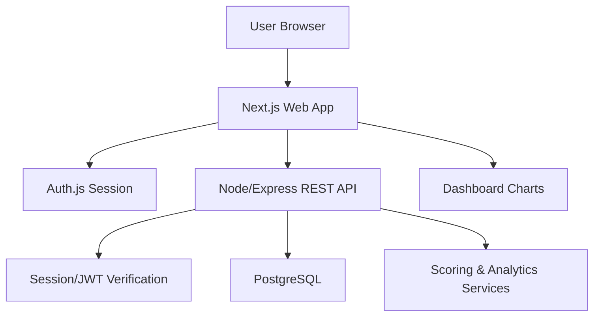

# PRD - SmartFellas

## 1. Overview

### Product Summary
SmartFellas helps a trivia team see what they know, what they miss, and how they improve. It is a post-game web app for logging completed bar trivia sheets and turning them into visual performance history. The MVP serves one team first, with teammate accounts and a data model ready for later multi-team expansion.

### Objective
This PRD covers the MVP defined in `docs/product-vision.md`: authentication, team membership, post-game logging, scoring validation, game history, dashboard visualizations, category and round analytics, wager performance, and prize/placement history. Live scoring, OCR, payments, host tools, and advanced recommendations are excluded.

### Market Differentiation
The implementation must focus on completed-game analysis, not live play. SmartFellas should feel purpose-built for the recurring paper-sheet workflow: rounds, categories, wagers, halftime partial credit, final wager outcomes, and visual trend reporting. The product wins when it is faster and more useful than a spreadsheet or old Python-to-Power-BI workflow.

### Magic Moment
The magic moment is the dashboard showing percent correct and points earned improving across several Wednesdays. Technically, this requires accurate game entry, reliable scoring calculations, and charts that update immediately after a saved game. The dashboard must be available to teammates without requiring them to edit data.

### Success Criteria
- A signed-in user can create a team, log a complete game, and see dashboard updates.
- A teammate can sign in and view shared team stats.
- Scoring rules reject invalid wager combinations for each round group.
- Dashboard includes percent correct over time, points earned over time, category accuracy, round performance, wager performance, and prize/placement history.
- Game entry takes less than 5 minutes after the user understands the form.
- P0 scoring logic has automated tests.
- App is usable on desktop and mobile web viewports.

## 2. Technical Architecture

### Architecture Overview


### Chosen Stack
| Layer | Choice | Rationale |
| --- | --- | --- |
| Frontend | Next.js | Fits a stats-heavy web app with teammate login, dashboards, future multi-team scaling, and strong support from modern AI coding tools. |
| Backend | Node/Express API | Gives practical reps with API design, backend structure, validation, auth boundaries, and testable business logic for scoring and analytics. |
| Database | PostgreSQL | Fits structured trivia history and analytics across teams, games, rounds, questions, categories, members, placements, and prizes. |
| Auth | Auth.js | Works well with Next.js and provides a practical middle path between hosted auth and fully custom security implementation. |
| Payments | None | The MVP is free while validating team usage and multi-team interest. |

### Stack Integration Guide
Use a monorepo with a Next.js app and Express API in the same repository. The API owns persistence, scoring, authorization checks, and analytics aggregation. The Next.js app owns routes, forms, dashboard views, and Auth.js session handling.

Install and configure the project in this order: Next.js with TypeScript, Tailwind CSS, shared linting/formatting, Express API, PostgreSQL connection, Prisma migrations, Auth.js, then feature modules. Use `zod` schemas in both the frontend and API where practical, with API validation as the source of truth.

Required environment variables:

```env
DATABASE_URL=
NEXTAUTH_URL=
NEXTAUTH_SECRET=
AUTH_TRUST_HOST=true
API_BASE_URL=http://localhost:4000
```

Common gotchas: do not trust client-calculated scores; the API must recalculate totals. Include `team_id` on all team-owned tables from the beginning. Keep Auth.js session identity mapped to an internal `users` table.

### Repository Structure
```text
project-root/
  apps/
    web/
      src/
        app/
          dashboard/
          games/
          team/
          settings/
        components/
          ui/
          charts/
          game-entry/
          dashboard/
        lib/
          api.ts
          auth.ts
          validation/
      public/
    api/
      src/
        index.ts
        routes/
        middleware/
        services/
          scoring.ts
          analytics.ts
        schemas/
        db/
          prisma.ts
      tests/
  prisma/
    schema.prisma
    migrations/
  docs/
  package.json
  pnpm-workspace.yaml
```

### Infrastructure & Deployment
Use Vercel for the Next.js frontend and a Node host such as Render, Railway, or Fly.io for the Express API. Use a managed PostgreSQL provider such as Neon, Supabase Postgres, Railway Postgres, or Render Postgres. For MVP simplicity, Railway can host both API and Postgres while Vercel hosts the frontend.

Set up CI to run linting, type checks, Prisma migration validation, and tests on pull requests. Do not deploy migrations automatically until the migration flow is proven.

### Security Considerations
All API routes except public health checks require authentication. Every team-owned query must check membership before reading or writing data. Use `zod` validation for request bodies, Prisma parameterized queries through the client, secure cookies for Auth.js, CSRF protection where applicable, and rate limiting for auth-sensitive and write-heavy endpoints.

### Cost Estimate
At low scale, expected monthly cost is $0-$25. Vercel free tier can host the frontend. Railway/Render/Fly may be free or low-cost for the API, depending on sleep and resource needs. Managed Postgres can start on a free tier through Neon or Supabase. Auth.js has no provider subscription cost. Payments are not used.

## 3. Data Model

### Entity Definitions
Use Prisma with PostgreSQL. Field names below are implementation targets.

```prisma
model User {
  id            String       @id @default(uuid()) @db.Uuid
  name          String?
  email         String       @unique
  image         String?
  createdAt     DateTime     @default(now())
  updatedAt     DateTime     @updatedAt
  memberships   TeamMember[]
  createdGames  Game[]       @relation("GameCreatedBy")
}

model Team {
  id          String       @id @default(uuid()) @db.Uuid
  name        String
  slug        String       @unique
  createdAt   DateTime     @default(now())
  updatedAt   DateTime     @updatedAt
  members     TeamMember[]
  games       Game[]
  categories  Category[]
}

model TeamMember {
  id        String   @id @default(uuid()) @db.Uuid
  teamId    String   @db.Uuid
  userId    String   @db.Uuid
  role      String   @default("member")
  createdAt DateTime @default(now())
  team      Team     @relation(fields: [teamId], references: [id], onDelete: Cascade)
  user      User     @relation(fields: [userId], references: [id], onDelete: Cascade)

  @@unique([teamId, userId])
  @@index([userId])
}

model Category {
  id        String     @id @default(uuid()) @db.Uuid
  teamId    String     @db.Uuid
  name      String
  createdAt DateTime   @default(now())
  team      Team       @relation(fields: [teamId], references: [id], onDelete: Cascade)
  questions Question[]

  @@unique([teamId, name])
  @@index([teamId])
}

model Game {
  id             String     @id @default(uuid()) @db.Uuid
  teamId         String     @db.Uuid
  createdById    String     @db.Uuid
  playedAt       DateTime
  venueName      String?
  placement      Int?
  totalTeams     Int?
  prizeAmount    Decimal?   @db.Decimal(10, 2)
  prizeLabel     String?
  notes          String?
  totalEarned    Int        @default(0)
  totalPossible  Int        @default(0)
  percentCorrect Decimal    @default(0) @db.Decimal(5, 2)
  createdAt      DateTime   @default(now())
  updatedAt      DateTime   @updatedAt
  team           Team       @relation(fields: [teamId], references: [id], onDelete: Cascade)
  createdBy      User       @relation("GameCreatedBy", fields: [createdById], references: [id])
  questions      Question[]
  halftime       Halftime?
  finalQuestion  FinalQuestion?

  @@index([teamId, playedAt])
}

model Question {
  id           String   @id @default(uuid()) @db.Uuid
  gameId       String   @db.Uuid
  categoryId   String   @db.Uuid
  roundNumber  Int
  questionNo   Int
  wagerValue   Int
  isCorrect    Boolean
  earnedPoints Int
  notes        String?
  game         Game     @relation(fields: [gameId], references: [id], onDelete: Cascade)
  category     Category @relation(fields: [categoryId], references: [id])

  @@unique([gameId, roundNumber, questionNo])
  @@index([categoryId])
  @@index([gameId, roundNumber])
}

model Halftime {
  id             String  @id @default(uuid()) @db.Uuid
  gameId         String  @unique @db.Uuid
  categoryLabel  String?
  partsTotal     Int     @default(4)
  partsCorrect   Int
  pointsPossible Int     @default(12)
  earnedPoints   Int
  notes          String?
  game           Game    @relation(fields: [gameId], references: [id], onDelete: Cascade)
}

model FinalQuestion {
  id            String  @id @default(uuid()) @db.Uuid
  gameId        String  @unique @db.Uuid
  categoryLabel String?
  wagerValue    Int
  isCorrect     Boolean
  earnedPoints  Int
  notes         String?
  game          Game    @relation(fields: [gameId], references: [id], onDelete: Cascade)
}
```

### Relationships
A user can belong to many teams through `TeamMember`. A team owns many games and categories. A game owns exactly 18 regular questions, optional halftime data, and optional final question data. Questions belong to normalized team categories. Deleting a team cascades to its games and categories; deleting a game cascades to its questions, halftime, and final question.

### Indexes
Index `games(team_id, played_at)` for dashboard and history queries. Index `questions(category_id)` for category analytics. Index `questions(game_id, round_number)` for game detail and round analytics. Index `team_members(user_id)` for finding a user's teams. Keep `categories(team_id, name)` unique to avoid duplicate labels per team.

## 4. API Specification

### API Design Philosophy
Use REST endpoints under `/api`. All authenticated endpoints require a bearer token or session-derived identity passed from the Next.js layer. Responses use JSON. Errors use `{ "error": string, "details"?: unknown }`. Use cursor or page pagination for game history once the list grows; simple limit/offset is acceptable for MVP.

### Endpoints

`GET /api/health`  
Auth: None  
Response 200: `{ status: "ok" }`

`GET /api/me`  
Auth: Required  
Response 200: `{ id: string, email: string, name?: string, teams: TeamSummary[] }`

`POST /api/teams`  
Auth: Required  
Body: `{ name: string, slug?: string }`  
Response 201: `{ id: string, name: string, slug: string, role: "owner" }`

`GET /api/teams/:teamId`  
Auth: Team member  
Response 200: `{ id: string, name: string, slug: string, members: TeamMemberSummary[] }`

`POST /api/teams/:teamId/members/invite`  
Auth: Team owner/admin  
Body: `{ email: string, role: "member" | "admin" }`  
Response 201: `{ email: string, role: string, status: "invited" }`  
MVP may implement this as direct membership if the user already exists, with email invite deferred.

`GET /api/teams/:teamId/categories`  
Auth: Team member  
Response 200: `{ categories: { id: string, name: string }[] }`

`POST /api/teams/:teamId/games`  
Auth: Team owner/admin  
Body:
```json
{
  "playedAt": "2026-05-06T02:00:00.000Z",
  "venueName": "Local bar",
  "placement": 2,
  "totalTeams": 12,
  "prizeAmount": 25,
  "prizeLabel": "Gift card",
  "rounds": [
    {
      "roundNumber": 1,
      "questions": [
        { "questionNo": 1, "categoryName": "History", "wagerValue": 2, "isCorrect": true }
      ]
    }
  ],
  "halftime": { "categoryLabel": "Movies", "partsTotal": 4, "partsCorrect": 2, "pointsPossible": 12 },
  "finalQuestion": { "categoryLabel": "Literature", "wagerValue": 5, "isCorrect": false },
  "notes": ""
}
```
Response 201: `{ id: string, totals: GameTotals }`  
Validation: rounds 1-3 must use wagers 2, 4, 6 exactly once per round; rounds 4-6 must use 5, 7, 9 exactly once per round; final wager must be 0-20.

`GET /api/teams/:teamId/games`  
Auth: Team member  
Query: `?limit=20&offset=0`  
Response 200: `{ games: GameSummary[], total: number }`

`GET /api/teams/:teamId/games/:gameId`  
Auth: Team member  
Response 200: full game detail with rounds, questions, halftime, final question, totals.

`PUT /api/teams/:teamId/games/:gameId`  
Auth: Team owner/admin  
Body: same as create game  
Response 200: `{ id: string, totals: GameTotals }`

`DELETE /api/teams/:teamId/games/:gameId`  
Auth: Team owner/admin  
Response 204: empty

`GET /api/teams/:teamId/analytics/summary`  
Auth: Team member  
Response 200: `{ gamesLogged: number, totalPoints: number, averagePercentCorrect: number, prizesWon: number, bestCategory?: string, weakestCategory?: string }`

`GET /api/teams/:teamId/analytics/trends`  
Auth: Team member  
Response 200: `{ percentCorrectOverTime: DataPoint[], pointsOverTime: DataPoint[], placementOverTime: DataPoint[] }`

`GET /api/teams/:teamId/analytics/categories`  
Auth: Team member  
Response 200: `{ categories: { name: string, correct: number, total: number, percentCorrect: number, pointsEarned: number, pointsPossible: number }[] }`

`GET /api/teams/:teamId/analytics/wagers`  
Auth: Team member  
Response 200: `{ wagers: { wagerValue: number, attempts: number, correct: number, percentCorrect: number, netPoints: number }[] }`

## 5. User Stories

### Epic: Team Access
**US-001: Create Team**  
As Thomas, I want to create a team space so that all SmartFellas games and stats live in one shared place.

Acceptance Criteria:
- [ ] Given I am signed in, when I create a team, then I become the owner.
- [ ] Given the team exists, when I open the dashboard, then I see that team's data.
- [ ] Edge case: duplicate slug -> show a clear error and ask for another name.

**US-002: Teammate Viewing**  
As a teammate, I want to sign in and view team stats so that I can follow the team's progress without entering data.

Acceptance Criteria:
- [ ] Given I am a member, when I open the dashboard, then I can view charts and history.
- [ ] Given I am only a member, when I try to edit a game, then the app denies the action.

### Epic: Game Logging
**US-003: Log Completed Game**  
As Thomas, I want to enter the completed paper sheet so that the game becomes structured performance data.

Acceptance Criteria:
- [ ] Given a valid sheet, when I save the form, then the API stores the game and calculated totals.
- [ ] Given a round has duplicate wager values, when I submit, then validation explains the issue.
- [ ] Edge case: halftime has unusual part count -> allow partsTotal to be changed.

**US-004: Edit Game**  
As Thomas, I want to correct a logged game so that mistakes from manual entry do not poison the stats.

Acceptance Criteria:
- [ ] Given I own the team, when I edit a game, then analytics recalculate after save.
- [ ] Given invalid updates, when I submit, then no partial update is saved.

### Epic: Dashboard Analytics
**US-005: View Progress Trends**  
As a teammate, I want to see percent correct and points over time so that I can tell whether the team is improving.

Acceptance Criteria:
- [ ] Given multiple games, when I view the dashboard, then line charts show trends by date.
- [ ] Given no games, when I view the dashboard, then I see an empty state prompting the first game log.

**US-006: View Category and Wager Performance**  
As Thomas, I want to see category and wager breakdowns so that we can understand where points are gained or lost.

Acceptance Criteria:
- [ ] Given logged games, when I view analytics, then categories show correct/total and points earned.
- [ ] Given wager data, when I view analytics, then wager values show accuracy and net points.

## 6. Functional Requirements

**FR-001: Authentication**  
Priority: P0  
Description: Users can sign in with Auth.js and are represented in the internal `users` table.  
Acceptance Criteria: protected pages redirect unauthenticated users; API rejects unauthenticated requests; user profile is created or synced on first login.  
Related Stories: US-001, US-002

**FR-002: Team Membership**  
Priority: P0  
Description: Users can create a team and access team-owned data based on membership role.  
Acceptance Criteria: owners can manage games; members can view dashboard/history; non-members receive 403.  
Related Stories: US-001, US-002

**FR-003: Game Logging Form**  
Priority: P0  
Description: The app provides a post-game form matching the trivia sheet structure: six rounds, halftime, final, placement, prizes, and notes.  
Acceptance Criteria: form supports 18 regular questions; category names can be entered or selected; halftime and final fields are available.  
Related Stories: US-003

**FR-004: Scoring Validation**  
Priority: P0  
Description: The API validates wagers and calculates earned points, possible points, totals, and percent correct.  
Acceptance Criteria: rounds 1-3 require 2/4/6 once per round; rounds 4-6 require 5/7/9 once per round; halftime partial credit is calculated; final correct adds wager and wrong subtracts wager.  
Related Stories: US-003, US-004

**FR-005: Game History**  
Priority: P0  
Description: Team members can view a chronological list of logged games with summary stats.  
Acceptance Criteria: list shows date, venue, placement, points, percent correct, prize, and links to detail.  
Related Stories: US-005

**FR-006: Dashboard Trends**  
Priority: P0  
Description: Dashboard visualizes percent correct and points earned over time.  
Acceptance Criteria: charts update after game save; empty state appears with no games; latest game is highlighted.  
Related Stories: US-005

**FR-007: Category Analytics**  
Priority: P0  
Description: Dashboard shows category-level accuracy and points performance.  
Acceptance Criteria: category table/chart includes correct, total, percent correct, points earned, and points possible.  
Related Stories: US-006

**FR-008: Wager Analytics**  
Priority: P1  
Description: Dashboard shows performance by wager value.  
Acceptance Criteria: wager breakdown includes attempts, correct count, percent correct, and net points.  
Related Stories: US-006

**FR-009: Prize and Placement History**  
Priority: P1  
Description: Games can store placement, total teams, prize amount, and prize label.  
Acceptance Criteria: dashboard and history show prize/placement summaries.  
Related Stories: US-003, US-005

**FR-010: Game Editing**  
Priority: P1  
Description: Owners/admins can edit existing games and trigger recalculation.  
Acceptance Criteria: updates are atomic; analytics reflect corrected data.  
Related Stories: US-004

**FR-011: CSV Export**  
Priority: P2  
Description: Team owner can export game and question data as CSV.  
Acceptance Criteria: export includes games, questions, categories, and totals.  
Related Stories: US-006

## 7. Non-Functional Requirements

### Performance
Dashboard initial load should complete in under 2 seconds on broadband and under 4 seconds on slower mobile connections for teams with fewer than 100 games. API analytics endpoints should respond in under 300ms p95 at MVP scale.

### Security
All protected API endpoints must enforce authentication and team membership. Use secure cookies for Auth.js sessions, `helmet` on Express, CORS restricted to the frontend origin, and rate limiting on write endpoints. Address common OWASP risks including injection, broken access control, and insecure direct object references.

### Accessibility
The app should meet WCAG 2.1 AA for forms, navigation, color contrast, and keyboard access. Charts must include text summaries or tables so analytics are not visual-only.

### Scalability
The MVP should support at least 25 teams, 250 users, and 2,500 games without schema changes. The data model must include team scoping from day one.

### Reliability
Target 99.5% uptime during MVP beta. Game saves must be atomic: either the full game, questions, halftime, final, and totals save, or nothing saves.

## 8. UI/UX Requirements

Visual tokens not yet defined. Run `/plaid design` before implementation begins.

### Screen: Sign In
Route: `/sign-in`  
Purpose: Authenticate users.  
Layout: Centered auth panel with product name and concise copy.  
States: loading session, auth form, auth error.  
Key Interactions: sign in -> redirect to dashboard; failed sign-in -> show clear error.  
Components Used: auth form, button, input, alert.

### Screen: Team Setup
Route: `/team/new`  
Purpose: Create the first team.  
Layout: Single form with team name and optional slug.  
States: empty, submitting, validation error, success redirect.  
Key Interactions: submit team -> create team -> dashboard.  
Components Used: form, input, button, inline validation.

### Screen: Dashboard
Route: `/dashboard`  
Purpose: Show team performance at a glance.  
Layout: Header with team selector, KPI cards, trend charts, category chart/table, wager summary, recent games.  
States: no team, no games, loading analytics, populated, error.  
Key Interactions: change date range -> refetch analytics; click game -> detail page; click log game -> new game form.  
Components Used: KPI card, line chart, bar chart, table, empty state, button.

### Screen: New Game
Route: `/games/new`  
Purpose: Enter a completed trivia sheet.  
Layout: Multi-section form: game meta, rounds 1-3, halftime, rounds 4-6, final, results.  
States: draft, validation errors, saving, save success, save failure.  
Key Interactions: enter category -> suggest existing categories; choose wagers -> enforce valid set; save -> API recalculates totals.  
Components Used: form section, question row, select, input, toggle, button, alert.

### Screen: Game Detail
Route: `/games/:gameId`  
Purpose: Review a logged game.  
Layout: Summary header, round-by-round details, halftime, final, placement/prize, edit button for admins.  
States: loading, populated, permission denied, not found.  
Key Interactions: edit -> open edit form; delete -> confirm dialog.  
Components Used: summary card, table, badge, confirm dialog.

### Screen: Game History
Route: `/games`  
Purpose: Browse logged games.  
Layout: Filterable table/list with date, venue, placement, points, percent correct, prize.  
States: no games, loading, populated, error.  
Key Interactions: filter/sort -> update list; click row -> detail.  
Components Used: table, filters, pagination.

### Screen: Team Settings
Route: `/team/settings`  
Purpose: View members and manage basic team settings.  
Layout: Team details form, member list, invite form.  
States: loading, populated, permission denied, invite pending.  
Key Interactions: invite teammate -> send/create membership; change role -> update permissions.  
Components Used: form, table, button, badge.

## 9. Auth Implementation

### Auth Flow
Use Auth.js in the Next.js app. Users sign in through configured providers, then the app syncs the authenticated profile to the API/internal `users` table. The frontend passes authenticated requests to the Express API using a session-aware token or server-side proxy pattern.

### Provider Configuration
Start with one provider for MVP. Email magic link or Google OAuth are both acceptable; choose the easiest configured provider during implementation. Required config includes `NEXTAUTH_SECRET`, `NEXTAUTH_URL`, and provider credentials if OAuth is used.

### Protected Routes
Protect `/dashboard`, `/games`, `/games/new`, `/team`, and `/settings`. Unauthenticated users redirect to `/sign-in`. API middleware must independently reject unauthenticated requests.

### User Session Management
Expose a session helper in `apps/web/src/lib/auth.ts`. API calls should include the current user's identity and never accept `userId` from client request bodies as proof of identity.

### Role-Based Access
Roles: `owner`, `admin`, `member`. Owners/admins can create, update, and delete games. Members can view dashboard, history, and game detail. Only owners can change roles in MVP.

## 10. Payment Integration

Payments are intentionally out of scope because the MVP revenue model is free. Revisit this section only if multi-team usage creates a reason to add paid plans.

## 11. Edge Cases & Error Handling

### Feature: Game Logging
| Scenario | Expected Behavior | Priority |
| --- | --- | --- |
| Duplicate wager in a round | Reject save and highlight the affected round. | P0 |
| Missing question result | Prevent submit and identify the row. | P0 |
| Halftime parts correct exceeds total | Prevent submit and show inline error. | P0 |
| Final wager above 20 | Prevent submit and show inline error. | P0 |
| Network failure on save | Preserve draft client-side and show retry action. | P1 |

### Feature: Auth and Teams
| Scenario | Expected Behavior | Priority |
| --- | --- | --- |
| Session expires | Redirect to sign-in and preserve intended route. | P0 |
| Non-member requests team data | Return 403 and show permission screen. | P0 |
| Member attempts edit | Return 403 and hide edit controls in UI. | P0 |

### Feature: Analytics
| Scenario | Expected Behavior | Priority |
| --- | --- | --- |
| No games logged | Show useful empty dashboard state. | P0 |
| Only one game logged | Show single-game summary and explain trends need more games. | P1 |
| Category has very small sample | Mark sample size clearly. | P1 |

## 12. Dependencies & Integrations

### Core Dependencies
```json
{
  "next": "latest",
  "react": "latest",
  "react-dom": "latest",
  "express": "latest",
  "@prisma/client": "latest",
  "next-auth": "latest",
  "zod": "latest",
  "recharts": "latest",
  "axios": "latest",
  "cors": "latest",
  "helmet": "latest",
  "express-rate-limit": "latest",
  "decimal.js": "latest"
}
```

### Development Dependencies
```json
{
  "typescript": "latest",
  "eslint": "latest",
  "prettier": "latest",
  "prisma": "latest",
  "tsx": "latest",
  "vitest": "latest",
  "supertest": "latest",
  "@testing-library/react": "latest",
  "@types/express": "latest",
  "@types/node": "latest"
}
```

### Third-Party Services
PostgreSQL hosting is required. Vercel is recommended for the frontend. Railway, Render, or Fly.io is recommended for the Express API. Auth provider credentials may be required depending on the Auth.js provider selected. No payment service is required.

## 13. Out of Scope

Live scoring is excluded because phones are not allowed during questions and the product is intentionally post-game.

OCR/photo extraction is excluded because manual entry must prove the workflow first. Reconsider after manual entry time is measured.

Payments are excluded while the product is free and validating usage.

Venue, host, and league dashboards are excluded because the MVP is team-first.

Advanced strategy recommendations are excluded until the team has enough logged game history.

## 14. Open Questions

Should the first auth provider be Google OAuth or email magic link? Recommended default: Google OAuth for fast teammate onboarding if everyone is comfortable with Google accounts.

Should category names be global or team-specific? Recommended default: team-specific categories for MVP to avoid premature taxonomy work.

Should invited teammates be added before they sign up? Recommended default: allow pending invites by email in the UI, but implement direct member addition first if email delivery slows the build.

Should game drafts persist locally before save? Recommended default: use local storage for the new game form to prevent data loss.

Should final wager allow zero? Recommended default: yes, because a team may choose to wager 0 if the host rules allow it.
